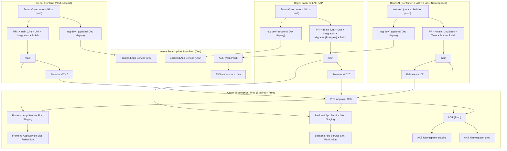

```mermaid
graph TD

subgraph NONPROD["Azure Subscription: Non-Prod (Dev)"]
  FE_DEV["Frontend App Service (Dev)"]
  BE_DEV["Backend App Service (Dev)"]
  ACR_NP["ACR (Non-Prod)"]
  AKS_DEV["AKS Namespace: dev"]
end

subgraph PROD["Azure Subscription: Prod (Staging + Prod)"]
  FE_STG["Frontend App Service Slot: Staging"]
  FE_PRD["Frontend App Service Slot: Production"]
  BE_STG["Backend App Service Slot: Staging"]
  BE_PRD["Backend App Service Slot: Production"]
  ACR_P["ACR (Prod)"]
  AKS_STG["AKS Namespace: staging"]
  AKS_PRD["AKS Namespace: prod"]
  APPROVE["Prod Approval Gate"]
end

subgraph FE["Repo: Frontend (Next.js React)"]
  FE_FB["feature/* (no auto build on push)"]
  FE_TAG["tag dev/* (optional Dev deploy)"]
  FE_PR["PR -> main (Lint + Unit + Integration + Build)"]
  FE_MAIN["main"]
  FE_REL["Release vX.Y.Z"]
end

subgraph BE["Repo: Backend (.NET API)"]
  BE_FB["feature/* (no auto build on push)"]
  BE_TAG["tag dev/* (optional Dev deploy)"]
  BE_PR["PR -> main (Lint + Unit + Integration + Migration(Postgres) + Build)"]
  BE_MAIN["main"]
  BE_REL["Release vX.Y.Z"]
end

subgraph AI["Repo: AI (Container -> ACR -> AKS Namespaces)"]
  AI_FB["feature/* (no auto build on push)"]
  AI_TAG["tag dev/* (optional Dev deploy)"]
  AI_PR["PR -> main (Lint/Static + Tests + Docker Build)"]
  AI_MAIN["main"]
  AI_REL["Release vX.Y.Z"]
end

FE_FB --> FE_PR --> FE_MAIN
FE_FB --> FE_TAG --> FE_DEV
FE_MAIN --> FE_STG
FE_MAIN --> FE_REL --> APPROVE --> FE_STG
FE_STG --> FE_PRD

BE_FB --> BE_PR --> BE_MAIN
BE_FB --> BE_TAG --> BE_DEV
BE_MAIN --> BE_STG
BE_MAIN --> BE_REL --> APPROVE --> BE_STG
BE_STG --> BE_PRD

AI_FB --> AI_PR --> AI_MAIN
AI_FB --> AI_TAG --> ACR_NP --> AKS_DEV
AI_MAIN --> ACR_P --> AKS_STG
AI_MAIN --> AI_REL --> APPROVE --> ACR_P --> AKS_PRD
```