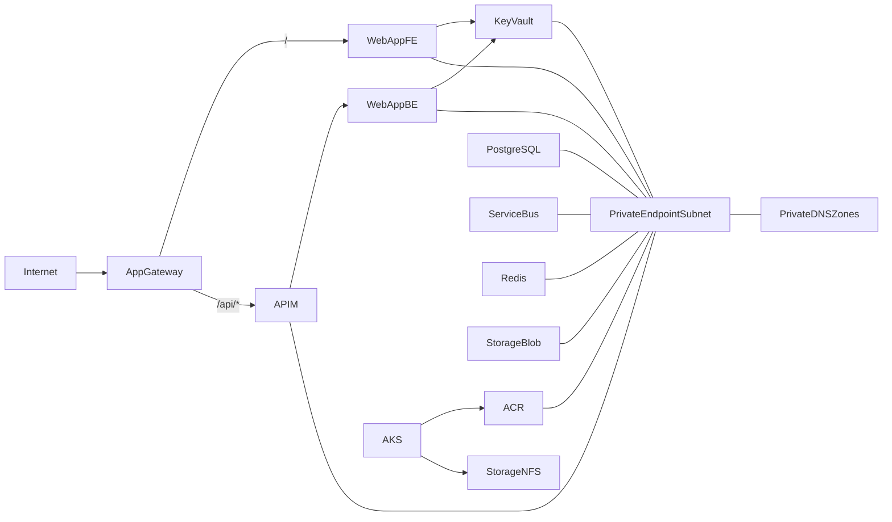
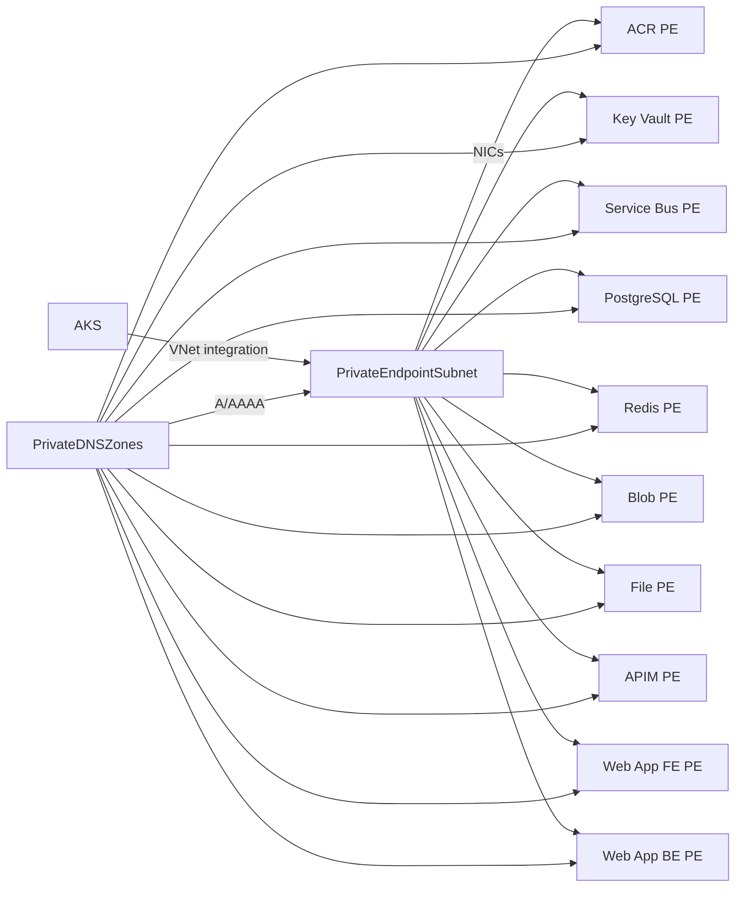

# App-AKS Landing Zone (App Service + AKS + Private Networking)

This landing zone provisions a private, service-integrated platform in East US that combines:

- AKS for container workloads
- App Service (frontend + backend) behind App Gateway and API Management
- Private endpoints + private DNS for all PaaS services
- Shared platform services (ACR, Key Vault, PostgreSQL, Service Bus, Redis, Storage)

All infrastructure is built with Azure Verified Modules (AVM) and a naming module for consistent naming.

Exceptions (no AVM module available today; kept as azurerm resources):
- Azure Monitor action group, metric alerts, workbook, and subscription Activity Log diagnostic setting
- API Management child resources (logger, diagnostic, API definitions)
- PostgreSQL Flexible Server database (created via azurerm resource)

## Architecture summary

Core building blocks:

- Resource group and VNet with five subnets (App Gateway, AKS, App Service integration, private endpoints, APIM)
- App Gateway (WAF v2) with public IP
- API Management (internal)
- App Service Plan (Windows) hosting frontend/back web apps
- AKS private cluster (system-assigned identity)
- ACR (private)
- Key Vault, PostgreSQL Flexible Server, Service Bus, Redis, Storage (private)
- Private DNS zones for every private endpoint + AKS private DNS zone
- Role assignments for AKS → ACR and App Services → Key Vault

## Dataflow



## DNS + Private endpoint resolution



## Resource inventory (what gets deployed)

Networking:

- VNet and 6 subnets:
  - app_gateway
  - aks
  - appsvc_integration (delegated to Microsoft.Web/serverFarms)
  - private_endpoints (private endpoint policies disabled)
  - apim
- NSG for APIM subnet (allow App Gateway; deny other VNet HTTP/S)

Ingress + API:

- Application Gateway (WAF_v2, static public IP)
- API Management (Internal VNet mode, private endpoint)
- APIM API that routes `/api` to backend App Service

Compute:

- App Service Plan (Windows, P1v3)
- Web App frontend + backend (Windows, private access only)
- AKS private cluster (system-assigned identity)

Data + integration:

- Azure Container Registry (private)
- Key Vault (private, RBAC)
- Service Bus (Standard)
- Redis Cache (Standard, note: zones require Premium)
- PostgreSQL Flexible Server (private access via private endpoint)
- Storage (Premium FileStorage for NFS; Standard StorageV2 for blobs)

Private connectivity:

- Private endpoints for ACR, KV, Service Bus, Redis, PostgreSQL, storage (file/blob), APIM (gateway), frontend web app, backend web app
- Private DNS zone `azure-api.net` with A records for APIM gateway/management endpoints (for internal VNet control plane access)
- Private DNS zones and VNet links for all private endpoints + AKS private DNS zone

Identity & access:

- Role assignment: AKS kubelet identity → ACR (AcrPull)
- Role assignment: Web App identities → Key Vault (Key Vault Secrets User)

## Observability (logging + diagnostics)

- Log Analytics workspace dedicated to the landing zone (PerGB2018, 30-day retention).
- Application Insights enabled for both web apps (frontend + backend), linked to the workspace.
- Application Insights logger for API Management (gateway diagnostics).
- AKS OMS agent enabled to send cluster logs/metrics to the workspace.
- Subscription Activity Log streamed to Log Analytics.
- NSG flow logs (Traffic Analytics) optional for the APIM NSG (disabled by default).
- App Service HTTP/application logs enabled (file system with 7-day retention).
- Azure Monitor action group + metric alerts (App Service Plan CPU, Web App HTTP 5xx).
- App-AKS overview workbook deployed in Azure Monitor.
- Diagnostic settings stream logs/metrics to Log Analytics for:
  - VNet, AKS, ACR, App Gateway (and its public IP)
  - API Management, Key Vault, Service Bus, Redis
  - PostgreSQL Flexible Server
  - Storage accounts (account-level metrics plus Blob/File service logs)

## Inputs and outputs

Inputs are in `landing-zones/app-aks/variables.tf`, with environment overrides in `landing-zones/app-aks/dev/terraform.tfvars`.

Key inputs:

- `location`, `location_short`
- `vnet_cidr` and `subnet_cidrs`
- `apim_publisher_name`, `apim_publisher_email`, `apim_sku_name`
- `tags`

Outputs (`landing-zones/app-aks/outputs.tf`):

- `resource_group_name`
- `virtual_network_id`
- `subnet_ids`
- `private_dns_zone_ids`

## Deployment (local state)

From `landing-zones/app-aks`:

```powershell
terraform init
terraform plan -var-file dev/terraform.tfvars -out app-aks-dev.tfplan
terraform apply "app-aks-dev.tfplan"
```

## SKU decision tree

Use this to downshift for dev/test or scale up for prod:

App Service Plan:

- Dev/test: B1/S1 if public access is acceptable
- Private + VNet integration: P1v3 minimum (current)
- Scale up: P2v3/P3v3 based on CPU/RAM needs

API Management:

- Dev/test: Developer_1 (current)
- Prod internal/private: Premium (multi-zone) or Standard v2

Redis:

- Standard for non-critical caching
- Premium required if you enable zones (module defaults to zones)

PostgreSQL Flexible Server:

- Burstable for dev/test (B-series)
- General Purpose for sustained workloads

Application Gateway:

- WAF_v2 for managed WAF and autoscaling
- Standard_v2 for lower cost if WAF not required

ACR:

- Premium if using private endpoints (default in AVM module)
- Standard if public access is acceptable and no advanced features

## Retail Prices API snapshot (East US)

These values were pulled from `https://prices.azure.com/api/retail/prices` using filters such as the shown `serviceName`, `skuName`, and `armRegionName`. They represent the canonical unit prices for the services listed and can be multiplied by the planned quantity/hours when estimating spend.

| Resource | API filter (partial) | East US rate | Notes |
| --- | --- | --- | --- |
| Application Gateway WAF_v2 | `serviceName eq 'Application Gateway' and skuName eq 'WAF_v2'` | $0.443/hour (plus $0.0144/hour per capacity unit) | Fixed + capacity units used in the WAF sizing. citeturn15search2 |
| App Service Plan (P1v3) | `serviceName eq 'App Service' and skuName eq 'Premium v3 P1v3'` | ~$0.330/hour | P1v3 is the smallest private App Service SKU. citeturn13search3 |
| AKS worker (Standard_DS2_v2) | `serviceName eq 'Virtual Machines' and skuName eq 'Standard_DS2_v2'` | $0.029215/hour | Worker VM cost for AKS system pool. citeturn16search0 |
| API Management Developer_1 | `serviceName eq 'API Management' and skuName eq 'Developer_1'` | ~$1.58/day (~$0.066/hour) | Cheapest way to expose APIs internally. citeturn18search1 |
| Redis Standard C1 (no zones) | `serviceName eq 'Azure Cache for Redis' and skuName eq 'Standard C1'` | ~$100.74/month | Standard tier base price before zones (Premium required for `zones`). citeturn23search1 |
| Service Bus Standard | `serviceName eq 'Service Bus' and skuName eq 'Standard'` | $0.0851/hour per messaging unit (first unit) | Base messaging unit charge; operations billed separately. citeturn21search1 |
| Container Registry Premium | `serviceName eq 'Container Registry' and skuName eq 'Premium'` | ~$1.677/day (~$0.070/hour) | Premium is required for private endpoints and geo-replication. citeturn26search2 |

## Cost estimate (East US)

This is a baseline estimate for a minimal, always-on dev environment. Data/egress and transaction-driven costs remain extra; their Retail Prices API rates are shown in the table above.

Assumptions:

- 730 hours/month
- 1 App Service Plan instance (P1v3)
- 1 AKS node (Standard_DS2_v2)
- App Gateway WAF_v2 with 2 capacity units
- Redis Standard C1 (if zones disabled)

Baseline known cost (from Microsoft pricing reference):

- Application Gateway WAF_v2 in East US:
  - Fixed: $0.443/hour
  - Capacity unit: $0.0144/hour each
  - Monthly estimate: (0.443 + 2 * 0.0144) * 730 ≈ $344/month
  - Data processing and egress are additional
  citeturn11search0

Everything else is billed per-instance or per-usage. Use the Retail Prices API filters listed above (or the Azure Pricing Calculator) to rehydrate East US totals for:

- App Service Plan (P1v3)
- AKS node VM (Standard_DS2_v2)
- API Management Developer tier
- Redis Standard C1
- Service Bus Standard namespace
- PostgreSQL Flexible Server
- ACR Premium
- Private Endpoints (10)
- Private DNS zones (10)
- Storage (Premium FileStorage + Standard LRS Blob)
citeturn5search0

## Known operational constraints

- PremiumV3 quota is required for the App Service Plan (P1v3).
- Redis zones require Premium; set `zones = null` (or switch to Premium) if using Standard.
- PostgreSQL Flexible Server provisioning can be restricted by region/tenant; pick another region or request an exception if blocked.

## Files to know

- `landing-zones/app-aks/main.tf` - core resources and wiring
- `landing-zones/app-aks/variables.tf` - inputs
- `landing-zones/app-aks/outputs.tf` - outputs
- `landing-zones/app-aks/dev/terraform.tfvars` - dev inputs
